# 마이링크 와이어프레임

## 1. 문서 개요

- 문서명: 마이링크 와이어프레임
- 프로젝트명: 마이링크 (MyLink)
- 작성 목적: PRD와 사용자 시나리오를 바탕으로 주요 UI 구조를 정의한다.
- 기준 문서: `docs/prd.md`, `docs/user-scenarios.md`, `docs/link-management.md`
- 표현 방식: Mermaid 다이어그램

---

## 2. 전체 화면 흐름

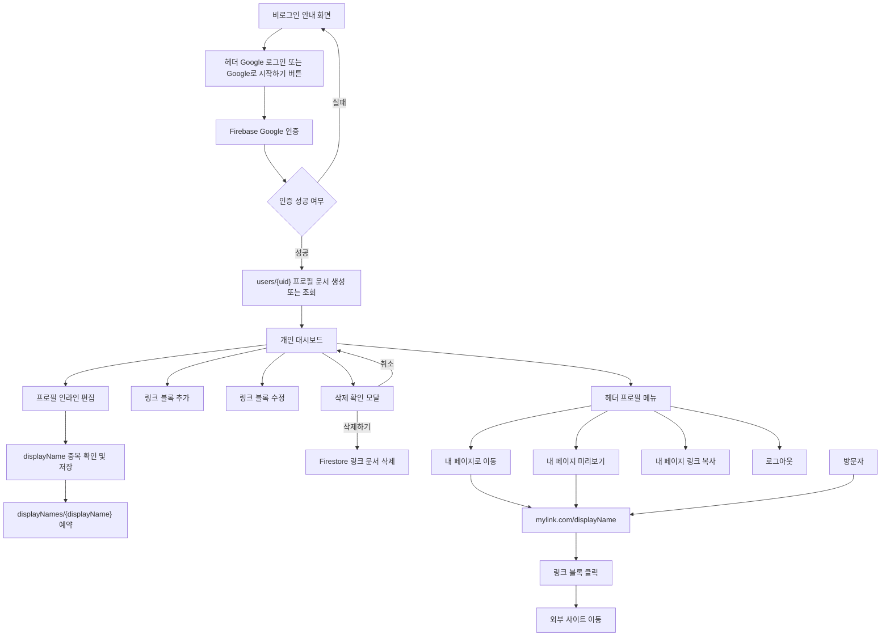

---

## 3. 랜딩 페이지 구조

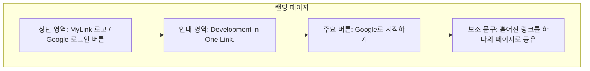

### 구성 요소

- 로고: `MyLink`
- 서비스 설명: 개발자와 크리에이터가 작업물, 포트폴리오, 소셜 미디어 링크를 한 곳에 모아 공유하는 서비스
- CTA: 헤더 `Google 로그인`, 본문 `Google로 시작하기`
- 비로그인 안내: `Github, 블로그, 포트폴리오까지 개발자의 정보를 한 페이지로 요약해보세요.` 문구를 표시
- 인증 방식: Firebase Authentication 기반 Google 소셜 로그인

---

## 4. 인증 이후 초기 프로필 생성 흐름

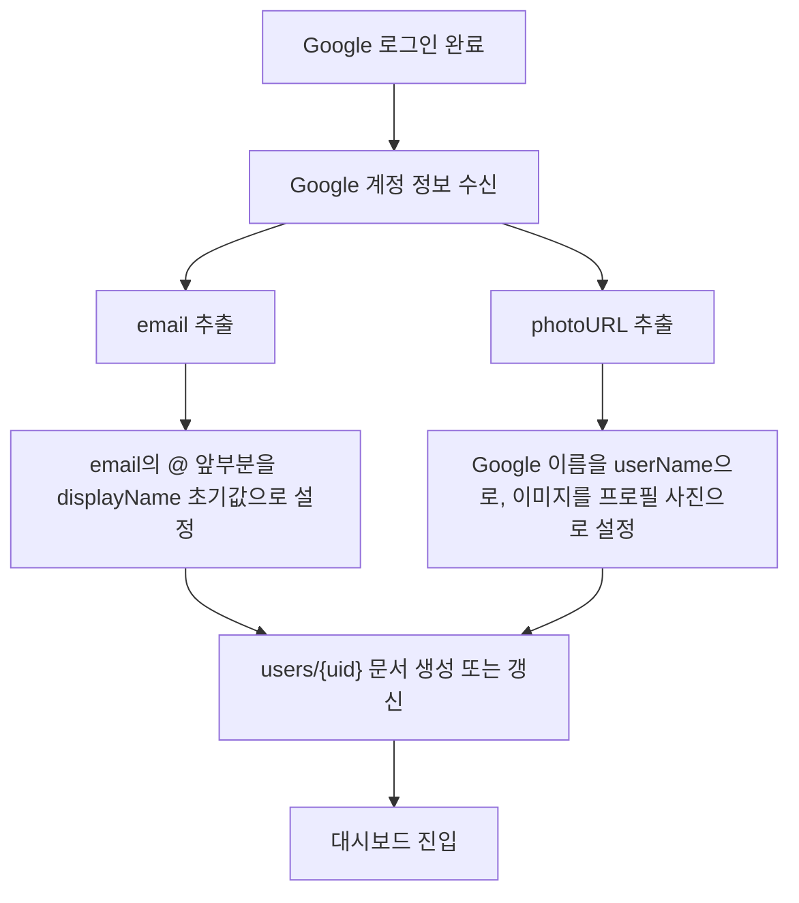

---

## 5. 대시보드 화면 구조

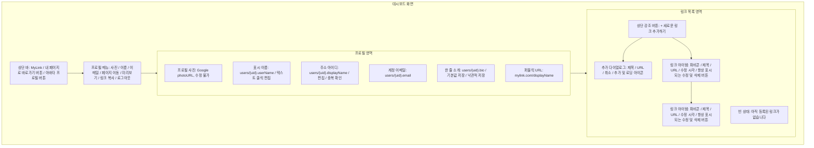

### 구성 요소

- 프로필 사진은 Google 계정 이미지를 사용하며 수정하지 않는다.
- 헤더에는 `내 페이지로 바로가기` 버튼을 표시하고, 프로필 아바타 버튼을 선택하면 사용자 요약, 내 페이지 이동, 내 페이지 미리보기, 링크 복사, 로그아웃 메뉴를 표시한다.
- 내 페이지 미리보기 다이얼로그는 현재 프로필과 `users/{uid}/links`의 링크 버튼 구성을 표시한다.
- 내 페이지 링크 복사 결과는 Sonner 토스트로 안내한다.
- 로그인한 사용자의 `users/{uid}` 문서에서 초기 Google 이름 또는 사용자가 편집한 `userName`, URL 아이디인 `displayName`, 이메일, 한 줄 소개를 가져와 표시한다.
- 표시 이름, 주소 아이디, 한 줄 소개는 호버 또는 키보드 포커스 시 연필 아이콘을 보여주며 텍스트를 클릭하면 편집할 수 있다.
- 표시 이름은 공백이 아닌 40자 이하의 값으로 저장하며 저장 요청 전에 퍼블릭 페이지와 프로필 메뉴에도 반영한다.
- 주소 아이디는 인라인 편집 후 `중복 확인`을 거쳐 저장하며, 저장 시 `displayNames/{displayName}` 예약 문서로 다시 충돌을 확인한다.
- 한 줄 소개 기본값은 `한 줄 소개를 입력해주세요.`이며 `users/{uid}.bio`에 저장한다.
- 프로필 편집은 낙관적으로 화면에 반영하며 저장 실패 시 이전 값으로 롤백하고 오류를 표시한다.
- 링크 목록 최상단에는 아이콘 하나와 문구만 담은 강조된 `새로운 링크 추가하기` 버튼을 표시하고 선택 시 추가 다이얼로그를 연다.
- 링크 목록은 링크 블록 단위로 표시한다.
- 링크 블록은 파비콘, 제목, URL, 수정된 경우의 마지막 수정 시각, 새 탭 열기 버튼, 항상 표시되는 연필 아이콘 및 삭제 버튼으로 구성한다.
- 별도의 모바일 기기 프레임 미리보기는 제공하지 않는다.

---

## 6. 프로필 인라인 편집 구조

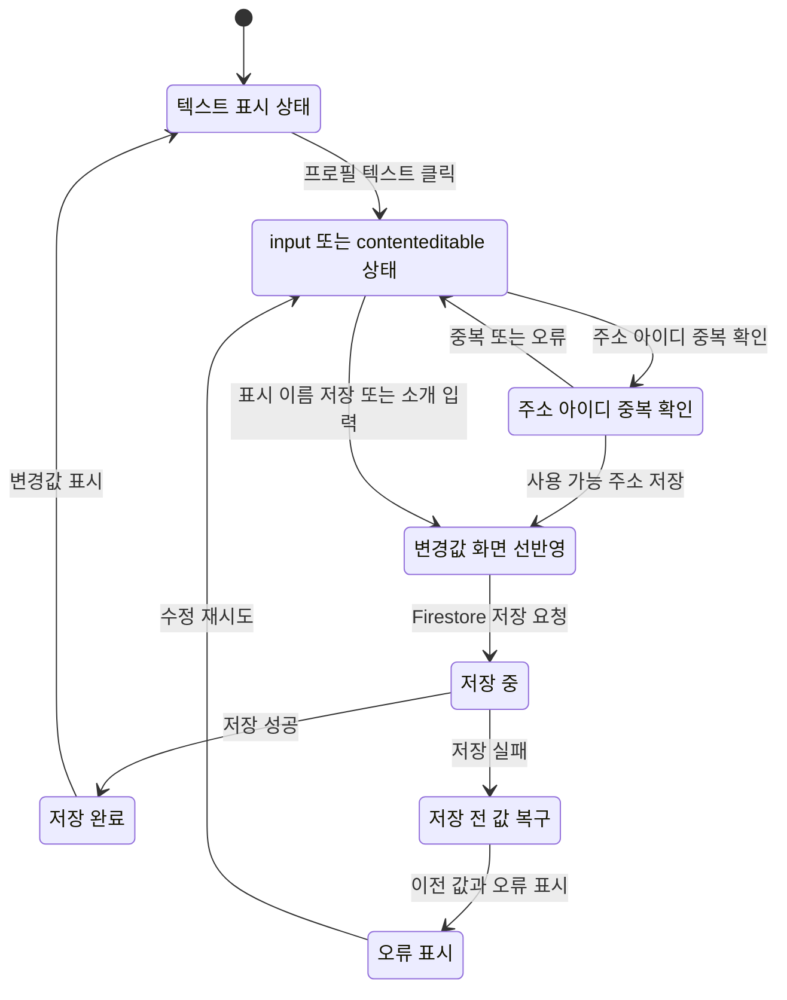

### 사용자 정보 규칙

- `displayName`은 이메일의 `@` 앞부분으로 초기화하며 URL slug로 사용한다.
- `displayName`은 비어 있을 수 없다.
- `displayName`은 영문 소문자, 숫자, `.`, `_`, `-`로 편집할 수 있으며 저장 전에 중복 확인을 거친다.
- 저장 시 `displayNames/{displayName}` 예약 문서와 프로필 문서를 하나의 트랜잭션으로 갱신한다.
- `userName`은 Google 계정 이름으로 초기화하는 편집 가능한 프로필 표시 이름이며 퍼블릭 URL을 변경하지 않는다.

---

## 7. 링크 블록 관리 구조

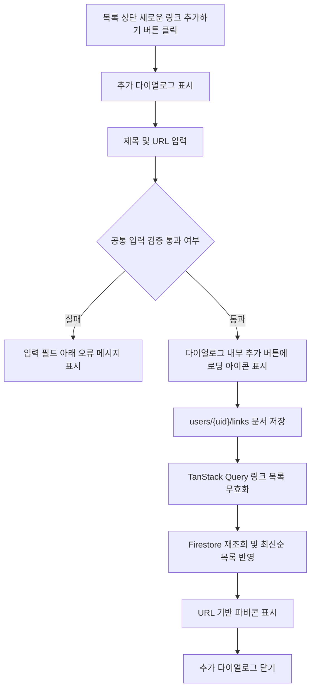

---

## 8. 링크 아이템 와이어프레임

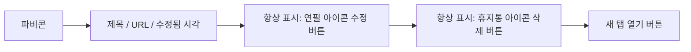

### 링크 아이템 구성

- 파비콘: `https://www.google.com/s2/favicons?domain={url}` 형식으로 클라이언트에서 동적 생성
- 제목: 방문자에게 보이는 버튼 제목
- URL: 클릭 시 이동할 외부 링크
- 수정됨 시각: `updatedAt`이 있는 링크에 마지막 수정 시각 표시
- 연필 아이콘: 항상 표시하며, 클릭 시 제목과 URL 인라인 수정 모드 진입
- 삭제 버튼: 항상 표시하며, 클릭 시 삭제 확인 모달 표시
- 새 탭 열기 버튼: 현재 링크 URL을 새 탭에서 열기

---

## 9. 링크 수정 상태 구조

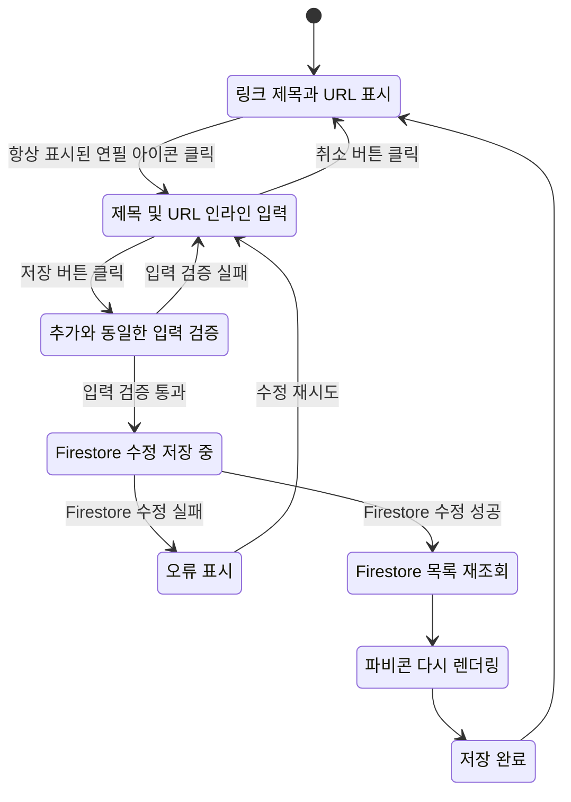

---

### 9.1. 링크 삭제 확인 모달 구조

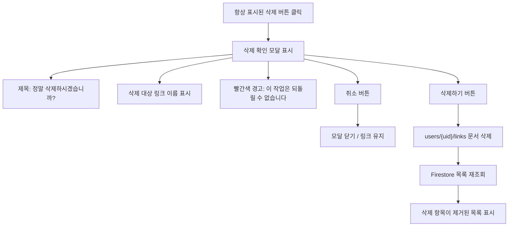

---

## 10. 퍼블릭 페이지 구조

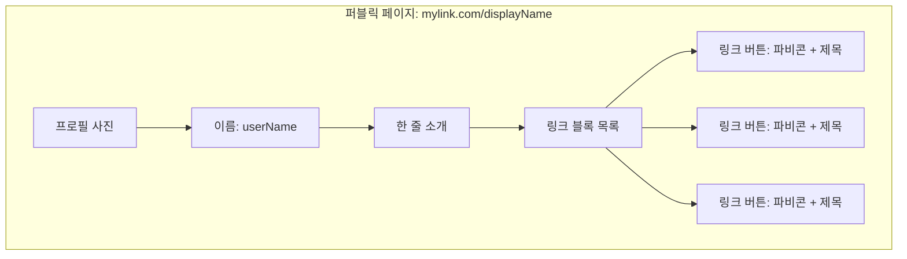

### 퍼블릭 페이지 규칙

- 방문자는 로그인 없이 접근한다.
- URL은 `mylink.com/displayName` 형식을 사용한다.
- `displayName`으로 사용자 문서를 검색하고 문서 ID에 해당하는 `users/{uid}/links` 목록을 표시한다.
- 검색된 문서에 `userName`이 없거나 사용자를 찾을 수 없으면 404 페이지를 표시한다.
- 프로필 이미지는 Google 계정 이미지를 사용한다.
- 링크 블록은 버튼 형태로 표시한다.
- 각 링크 버튼은 파비콘과 제목을 함께 표시한다.
- 링크 클릭 시 외부 사이트로 이동한다.

---

## 11. 반응형 구조

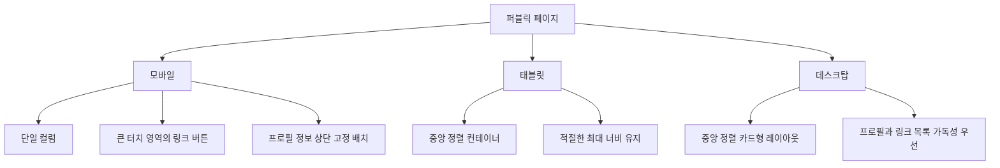

---

## 12. 오류 및 빈 상태 구조

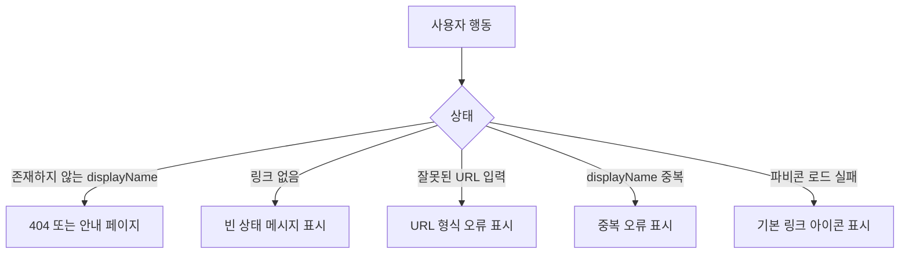

---

## 13. 추후 링크 클릭 조회수 위치

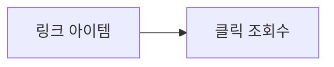

### 적용 범위

- 방문자 통계 또는 분석 대시보드는 포함하지 않는다.
- 추후 개별 링크 블록에 클릭 조회수만 표시할 수 있다.

---

## 14. ASCII 아트 와이어프레임

### 14.1. 랜딩 페이지

```text
┌────────────────────────────────────────────────────────────┐
│ MyLink                                        Google 로그인 │
├────────────────────────────────────────────────────────────┤
│                                                            │
│                 Development in One Link.                   │
│                                                            │
│     Github, 블로그, 포트폴리오까지 개발자의 정보를           │
│     한 페이지로 요약해보세요.                              │
│                                                            │
│                  ┌────────────────────┐                    │
│                  │ Google로 시작하기   │                    │
│                  └────────────────────┘                    │
│                                                            │
└────────────────────────────────────────────────────────────┘
```

### 14.2. 대시보드 - 기본 상태

```text
┌────────────────────────────────────────────────────────────┐
│ MyLink               [내 페이지로 바로가기 ↗] [Avatar] ▾  │
├────────────────────────────────────────────────────────────┤
│                                                            │
│  ┌──────────────┐                                          │
│  │ Google Photo │  Google 계정                             │
│  │              │  Kim Cheolsu                             │
│  └──────────────┘                                          │
│                  @dev_kim (displayName)             [hover ✎]│
│                                                            │
│  dev_kim@gmail.com                                         │
│  한 줄 소개를 입력해주세요.                       [hover ✎] │
│                                                            │
│  퍼블릭 URL: mylink.com/dev_kim (displayName)               │
│                                                            │
├────────────────────────────────────────────────────────────┤
│  ┌──────────────────────────────────────────────────────┐  │
│  │                + 새로운 링크 추가하기              │  │
│  └──────────────────────────────────────────────────────┘  │
│                                                            │
│  ┌──────────────────────────────────────────────────────┐  │
│  │ 🌐  My Blog                           blog.example   │  │
│  │     수정됨 2026. 5. 27. 오후 2:30         ✎   삭제    │  │
│  └──────────────────────────────────────────────────────┘  │
│                                                            │
│  ┌──────────────────────────────────────────────────────┐  │
│  │ 🐙  GitHub                            github.com     │  │
│  │     https://github.com/devkim              ✎   삭제   │  │
│  └──────────────────────────────────────────────────────┘  │
│                                                            │
└────────────────────────────────────────────────────────────┘
```

### 14.3. 헤더 - 프로필 메뉴 상태

```text
                                   ┌──────────────────────────┐
                                   │ [Avatar]  Kim Cheolsu    │
                                   │           user@email.com │
                                   ├──────────────────────────┤
                                   │ ↗  내 페이지로 이동      │
                                   │ 👁  내 페이지 미리보기    │
                                   │ 🔗  내 페이지 링크 복사   │
                                   ├──────────────────────────┤
                                   │ ↪  로그아웃              │
                                   └──────────────────────────┘
```

### 14.4. 대시보드 - 프로필 인라인 편집 상태

```text
┌────────────────────────────────────────────────────────────┐
│ 프로필 영역                                                 │
├────────────────────────────────────────────────────────────┤
│                                                            │
│  ┌──────────────┐                                          │
│  │ Google Photo │  ┌─────────────────────────┐              │
│  │  수정 불가   │  │ Kim Cheolsu       저장 취소│              │
│  └──────────────┘  └─────────────────────────┘              │
│                  ┌─────────────────────────┐ ┌──────┐    │
│                  │ @dev_kim                │ │중복확인│    │
│                  └─────────────────────────┘ └──────┘    │
│                  사용 가능한 주소 아이디입니다.   저장 취소 │
│                                                            │
│                  ┌──────────────────────────────────┐      │
│                  │ 한 줄 소개를 입력해주세요.           │      │
│                  └──────────────────────────────────┘      │
│                                                            │
│  안내: 호버 시 연필 표시, 텍스트 클릭 시 수정 모드 진입        │
│  안내: 소개글 입력 중 자동 저장                             │
│  오류: displayName 중복 시 저장 불가                        │
│                                                            │
└────────────────────────────────────────────────────────────┘
```

### 14.5. 대시보드 - 새 링크 추가 상태

```text
┌────────────────────────────────────────────────────────────┐
│ 새 링크 추가                                        닫기 ×  │
├────────────────────────────────────────────────────────────┤
│                                                            │
│  버튼 제목                                                 │
│  ┌──────────────────────────────────────────────────────┐  │
│  │ 기술 블로그                                           │  │
│  └──────────────────────────────────────────────────────┘  │
│                                                            │
│  URL                                                       │
│  ┌──────────────────────────────────────────────────────┐  │
│  │ https://blog.example.com                              │  │
│  └──────────────────────────────────────────────────────┘  │
│                                                            │
│                                    ┌──────┐ ┌──────────┐  │
│                                    │ 취소 │ │ 추가하기 │  │
│                                    └──────┘ └──────────┘  │
│                                                            │
└────────────────────────────────────────────────────────────┘

저장 중 다이얼로그 버튼: [    ⟳    ]
저장 성공 시: 다이얼로그 닫힘
```

### 14.6. 대시보드 - 링크 인라인 수정 상태

```text
┌────────────────────────────────────────────────────────────┐
│ 링크 아이템                                                 │
├────────────────────────────────────────────────────────────┤
│                                                            │
│  ┌──────────────────────────────────────────────────────┐  │
│  │ 🌐  ┌────────────────────────────────────────────┐   │  │
│  │     │ My Blog                                    │   │  │
│  │     └────────────────────────────────────────────┘   │  │
│  │     ┌────────────────────────────────────────────┐   │  │
│  │     │ https://blog.example.com                   │   │  │
│  │     └────────────────────────────────────────────┘   │  │
│  │                                         저장   취소    │  │
│  └──────────────────────────────────────────────────────┘  │
│                                                            │
│  안내: 항상 표시되는 연필 아이콘 클릭 시 input으로 전환       │
│  안내: 제목 필수값과 URL 형식을 확인한 뒤 저장               │
│                                                            │
└────────────────────────────────────────────────────────────┘
```

### 14.7. 대시보드 - 링크 삭제 확인 모달

```text
┌────────────────────────────────────────────────────────────┐
│                                                            │
│          ┌──────────────────────────────────────┐          │
│          │ 정말 삭제하시겠습니까?               │          │
│          │                                      │          │
│          │ ┌──────────────────────────────────┐ │          │
│          │ │ 기술 블로그                       │ │          │
│          │ └──────────────────────────────────┘ │          │
│          │                                      │          │
│          │ 이 작업은 되돌릴 수 없습니다 (빨간색) │          │
│          │                                      │          │
│          │              ┌──────┐ ┌──────────┐  │          │
│          │              │ 취소 │ │ 삭제하기 │  │          │
│          │              └──────┘ └──────────┘  │          │
│          └──────────────────────────────────────┘          │
│                                                            │
└────────────────────────────────────────────────────────────┘
```

### 14.8. 퍼블릭 페이지 - 모바일

```text
┌──────────────────────────────┐
│                              │
│          ┌────────┐          │
│          │ Photo  │          │
│          └────────┘          │
│                              │
│            dev_kim           │
│      Frontend Developer      │
│                              │
│ ┌──────────────────────────┐ │
│ │ 🌐  My Blog              │ │
│ └──────────────────────────┘ │
│                              │
│ ┌──────────────────────────┐ │
│ │ 🐙  GitHub               │ │
│ └──────────────────────────┘ │
│                              │
│ ┌──────────────────────────┐ │
│ │ 🚀  Project Demo         │ │
│ └──────────────────────────┘ │
│                              │
└──────────────────────────────┘
```

### 14.9. 퍼블릭 페이지 - 데스크탑

```text
┌────────────────────────────────────────────────────────────┐
│                                                            │
│                    ┌────────────────────┐                  │
│                    │       Photo        │                  │
│                    └────────────────────┘                  │
│                                                            │
│                         dev_kim                            │
│                    Frontend Developer                      │
│                                                            │
│          ┌──────────────────────────────────────┐          │
│          │ 🌐  My Blog                          │          │
│          └──────────────────────────────────────┘          │
│                                                            │
│          ┌──────────────────────────────────────┐          │
│          │ 🐙  GitHub                           │          │
│          └──────────────────────────────────────┘          │
│                                                            │
│          ┌──────────────────────────────────────┐          │
│          │ 🚀  Project Demo                     │          │
│          └──────────────────────────────────────┘          │
│                                                            │
└────────────────────────────────────────────────────────────┘
```

### 14.10. 오류 및 빈 상태

```text
┌────────────────────────────────────────────────────────────┐
│ 빈 링크 목록                                                │
├────────────────────────────────────────────────────────────┤
│                                                            │
│                  아직 등록된 링크가 없습니다.               │
│                                                            │
│                  ┌────────────────────┐                    │
│                  │ + 새로운 링크 추가하기│                    │
│                  └────────────────────┘                    │
│                                                            │
└────────────────────────────────────────────────────────────┘

┌────────────────────────────────────────────────────────────┐
│ 오류 상태                                                   │
├────────────────────────────────────────────────────────────┤
│                                                            │
│  displayName이 이미 사용 중입니다.                          │
│  다른 이름을 입력해주세요.                                  │
│                                                            │
│  URL 형식이 올바르지 않습니다.                              │
│  https:// 로 시작하는 주소를 입력해주세요.                   │
│                                                            │
└────────────────────────────────────────────────────────────┘
```
